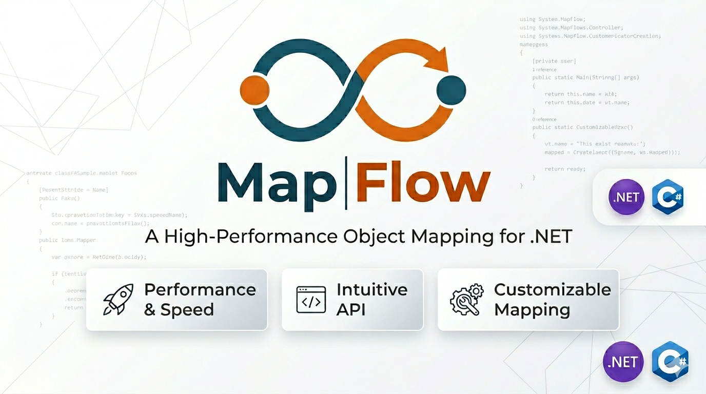

# MapFlow

<p align="center">
  
</p>

**Zero-reflection, zero-dependency object mapper for .NET.**  
Map objects via interfaces, selectors, or in-place mutation. Ships a Source Generator that writes the boring mapping code for you.

```shell
dotnet add package MapFlow
```

---

## Philosophy

Most object mappers in .NET work like this:

1. Scan assemblies with reflection to find mapping profiles.
2. Build expression trees at runtime for each type pair.
3. Compile those trees into delegates.
4. Cache everything in global dictionaries.

It works, but it has a cost: slow startup, extra memory, Native AOT incompatibility, and a layer of magic that makes it hard to understand what's happening when a mapping fails.

MapFlow does the opposite:

**Make it explicit.** Instead of "configure the mapping and let us handle the rest," we say: "write your mapping or let the Source Generator do it at compile time."

**Zero magic.** Every mapping is C# code you can read, debug, and test. No expression trees, no reflection, no runtime-compiled delegates.

**Two approaches, one library.** Use whichever fits the moment:
- **Lambda-based**: for ad-hoc, one-off mappings.
- **Interface-based**: for repeatable mappings, with an optional Source Generator.

**Zero dependencies.** Literally zero NuGet packages. Not even the Source Generator — the analyzer ships inside the same package.

---

## Quick comparison

| | MapFlow | Mapster | Mapperly | AutoMapper |
|---|---|---|---|---|
| **Runtime reflection** | ❌ No | ✅ Yes | ❌ No (SG) | ✅ Yes |
| **Expression trees** | ❌ No | ✅ Yes | ❌ No (SG) | ✅ Yes |
| **NuGet dependencies** | **0** | 2+ | 1 (analyzer) | 4+ |
| **Startup overhead** | **0** | Low–Medium | 0 | High |
| **AOT compatible** | ✅ Full | ⚠️ Partial | ✅ Full | ❌ No |
| **Debuggable** | ✅ Direct C# | ⚠️ Expression trees | ✅ Generated C# | ❌ Reflection |
| **Two approaches** | ✅ Lambdas + Interfaces | ❌ Config only | ❌ Partial methods only | ❌ Config only |
| **Source Generator** | ✅ Included | ⚠️ Mapster.Tool extra | ✅ Native | ❌ |
| **PagedResult** | ✅ Built-in | ❌ | ❌ | ❌ |
| **Mutation (Apply)** | ✅ Built-in | ❌ | ❌ | ❌ |

---

## How to use MapFlow

### Installation

```shell
dotnet add package MapFlow
```

That's it. No `AddMapFlow()`, no `TypeAdapterConfig`, no profile scanning. Install and use.

---

### Approach 1: Lambda-based (ad-hoc)

The simplest. When you need to map one object to another at a specific point and an interface isn't worth it:

```csharp
using MapFlow;

var dto = product.Map(p => new ProductDto
{
    Id = p.Id,
    Name = p.Name,
    Price = p.Price,
    CategoryName = p.Category.Name
});
```

Works with collections:

```csharp
var dtos = products.Map(p => new ProductDto { Id = p.Id, Name = p.Name });
```

With PagedResult:

```csharp
var dtos = pagedResult.Map(p => new ProductDto { Id = p.Id, Name = p.Name });
// dtos.Items, dtos.RowCount, etc. preserved
```

**When to use it:** When the mapping is one-off or has conditional logic that doesn't justify an interface.

---

### Approach 2: Interface-based (declarative)

When the same mapping appears in multiple places, avoid repeating the lambda:

```csharp
public class ProductDto : IMapFrom<Product>
{
    public int Id { get; set; }
    public string Name { get; set; } = string.Empty;
    public decimal Price { get; set; }

    // You write the mapping ONCE
    public void MapFrom(Product source)
    {
        Id = source.Id;
        Name = source.Name;
        Price = source.Price;
    }
}
```

Then it's as simple as:

```csharp
// Single
var dto = Mapper.Map<Product, ProductDto>(product);

// Collection
var dtos = Mapper.Map<Product, ProductDto>(products);

// PagedResult
var dtos = Mapper.Map<Product, ProductDto>(pagedResult);

// Or with the fluent alias (same thing):
var dto = product.MapTo<Product, ProductDto>();    // single
var dtos = products.MapTo<Product, ProductDto>();   // collection
var dtos = paged.MapTo<Product, ProductDto>();      // PagedResult
```

#### Approach 2b: Project (IMapTo)

When the **source** knows how to produce the target, use `IMapTo<T>` and `Project<T>()`:

```csharp
public class ProductEntity : IMapTo<ProductDto>
{
    public int Id { get; set; }
    public string Name { get; set; } = string.Empty;
    public decimal Price { get; set; }

    // You write the mapping ONCE
    public ProductDto MapTo() => new()
    {
        Id = Id,
        Name = Name,
        Price = Price
    };
}
```

Usage:

```csharp
// Single — one type param, clean syntax
var dto = product.Project<ProductDto>();

// Works in any direction — the interface is neutral:
// entity.Project<Dto>()  or  dto.Project<Entity>()
```

`IMapTo<T>` and `IMapFrom<T>` are **mechanical contracts**, not business-role interfaces:

| Interface | Meaning | Direction |
|---|---|---|
| `IMapTo<T>` | "this produces T" | **this → T** |
| `IMapFrom<T>` | "this gets populated from T" | **T → this** |

Both work with the Source Generator for zero-boilerplate auto-mapping.

You can also apply onto an existing instance:

```csharp
Mapper.Apply(product, existingDto);
```

**When to use it:** When the same mapping appears in 2+ places. The DTO defines the logic, `Mapper` executes it.

---

### Approach 3: Source Generator (auto-magic)

If the mapping is trivial (same name and type → copy), don't even write `MapFrom`. Make the class `partial` and the Source Generator writes it at compile time:

```csharp
public partial class ProductDto : IMapFrom<Product>
{
    public int Id { get; set; }
    public string Name { get; set; } = string.Empty;
    public decimal Price { get; set; }
    // ↑ The SG generates MapFrom at compile time
}
```

This generates the following code (visible in the compiler's generated files):

```csharp
// <auto-generated/>
partial class ProductDto
{
    public void MapFrom(Product source)
    {
        this.Id = source.Id;
        this.Name = source.Name;
        this.Price = source.Price;
        CustomMapFrom(source);
    }

    partial void CustomMapFrom(Product source);
}
```

#### CustomMapFrom — the hook for custom logic

When you have one or two properties that need special handling, you don't need to write the entire `MapFrom` manually. The SG gives you a `partial void CustomMapFrom(TSource source)` hook:

```csharp
public partial class ProductDto : IMapFrom<Product>
{
    public int Id { get; set; }
    public string Name { get; set; } = string.Empty;
    public string CategoryName { get; set; } = string.Empty; // doesn't exist on Product

    // The SG maps Id and Name, then calls CustomMapFrom
    partial void CustomMapFrom(Product source)
    {
        CategoryName = source.Category?.Name ?? "N/A";
    }
}
```

#### IMapTo — the reverse direction

If you prefer the entity to know how to create its DTO:

```csharp
public partial class Product : IMapTo<ProductDto>
{
    public int Id { get; set; }
    public string Name { get; set; } = string.Empty;
    public decimal Price { get; set; }
    // ↑ The SG generates MapTo() returning a new ProductDto
}
```

Usage:

```csharp
var dto = ((IMapTo<ProductDto>)product).MapTo();
```

#### Which properties does it auto-map?

The SG matches properties by **exact name** AND **exact type**. If both match, they're included. If not, they're skipped — no surprises at runtime.

#### What if you already wrote MapFrom manually?

The SG detects you already implemented the method (including explicit interface implementations) and **generates nothing**. Your manual implementation always takes priority.

#### Records and structs

Everything works with `record`, `record struct`, and `struct` too:

```csharp
public partial record class ProductDto : IMapFrom<Product>
{
    public int Id { get; set; }
    public string Name { get; set; } = string.Empty;
}
```

**When to use it:** When you have DTOs with properties that match 1:1 with the entity. Which is, most of the time.

---

### In-place mutation (Apply)

Sometimes you need to modify an existing object instead of creating a new one:

```csharp
// Modify and return the same instance
product.Apply(p =>
{
    p.Name = request.Name;
    p.Price = request.Price;
    p.UpdatedAt = DateTime.UtcNow;
});

// Transform and return a new one (immutable)
var updated = product.Apply(p => new Product(p.Id, request.Name, p.Price));
```

**What's it for?** Transformation pipelines where each step modifies something and then maps:

```csharp
var result = entity
    .Apply(e => e.Name = e.Name.Trim())         // 1. clean
    .Apply(e => e.CreatedAt = DateTime.UtcNow)  // 2. timestamp
    .Map(e => new Dto { Name = e.Name });        // 3. project
```

---

### Null safety

All public entry points (`Mapper.Map`, `Mapper.Apply`, extension methods) validate arguments against `null` and throw `ArgumentNullException` with the parameter name. You don't need to remember to check yourself.

---

## PagedResult

It ships with the package — no need to create your own:

```csharp
public class PagedResult<T>
{
    public int RowCount { get; set; }
    public int PageNumber { get; set; } = 1;
    public int PageSize { get; set; } = 10;
    public int PageCount { get; set; }
    public List<T> Items { get; set; } = [];
}
```

Map it with a lambda directly from the instance (a real method, not an extension):

```csharp
var dtos = paged.Map(p => new ProductDto { Id = p.Id, Name = p.Name });
```

Or via interface-based from `Mapper.Map`:

```csharp
var dtos = Mapper.Map<Product, ProductDto>(pagedResult);
```

Or with the fluent alias:

```csharp
var dtos = pagedResult.MapTo<Product, ProductDto>();
```

---

## Usage tips

### 1. Small projects or simple APIs
Use lambda-based only. No interfaces, no SG, nothing beyond `using MapFlow;`.

### 2. Medium+ projects with repeated DTOs
Make DTOs implement `IMapFrom<T>` and use the SG. The SG auto-generates `MapFrom` for matching properties, and you fill in the special logic with `CustomMapFrom`.

### 3. Teams coming from AutoMapper
Don't try to replicate profiles or resolvers. MapFlow is a different paradigm: more explicit, less magic. The transition is: each `CreateMap` becomes an `IMapFrom<TSource>` on the DTO. There's no `ForMember`, no `IValueResolver`, no `Profile`. There are methods you write.

### 4. Services targeting Native AOT
MapFlow is fully AOT compatible. No reflection, no expression trees, no dynamic loading. The Source Generator produces C# code the AOT compiler can process without issues.

---

## Project structure

```
MapFlow/
├── src/
│   ├── MapFlow/                          # net8.0 — core library
│   │   ├── IMapFrom.cs                   # Source → destination mapping interface
│   │   ├── IMapTo.cs                     # Self → destination mapping interface
│   │   ├── Mapper.cs                     # Static entry point
│   │   ├── MapperExtensions.cs           # Fluent extension methods
│   │   ├── PagedResult.cs                # Pagination with built-in Map
│   │   └── MapFlow.png                   # Package icon
│   └── MapFlow.SourceGenerator/          # netstandard2.0 — Source Generator
│       └── MapFromGenerator.cs           # Generates MapFrom/MapTo at compile time
└── test/
    └── MapFlow.Tests/                    # net10.0 — 40 tests
        ├── MapperTests.cs                # 21 tests (core + null guards)
        ├── PagedResultTests.cs           # 8 tests
        └── SourceGeneratorTests.cs       # 11 tests (SG integration)
```

---

## License

MIT
